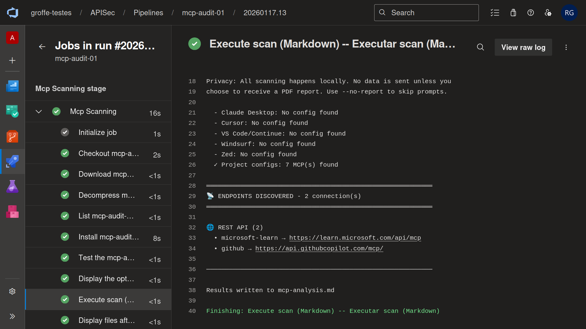
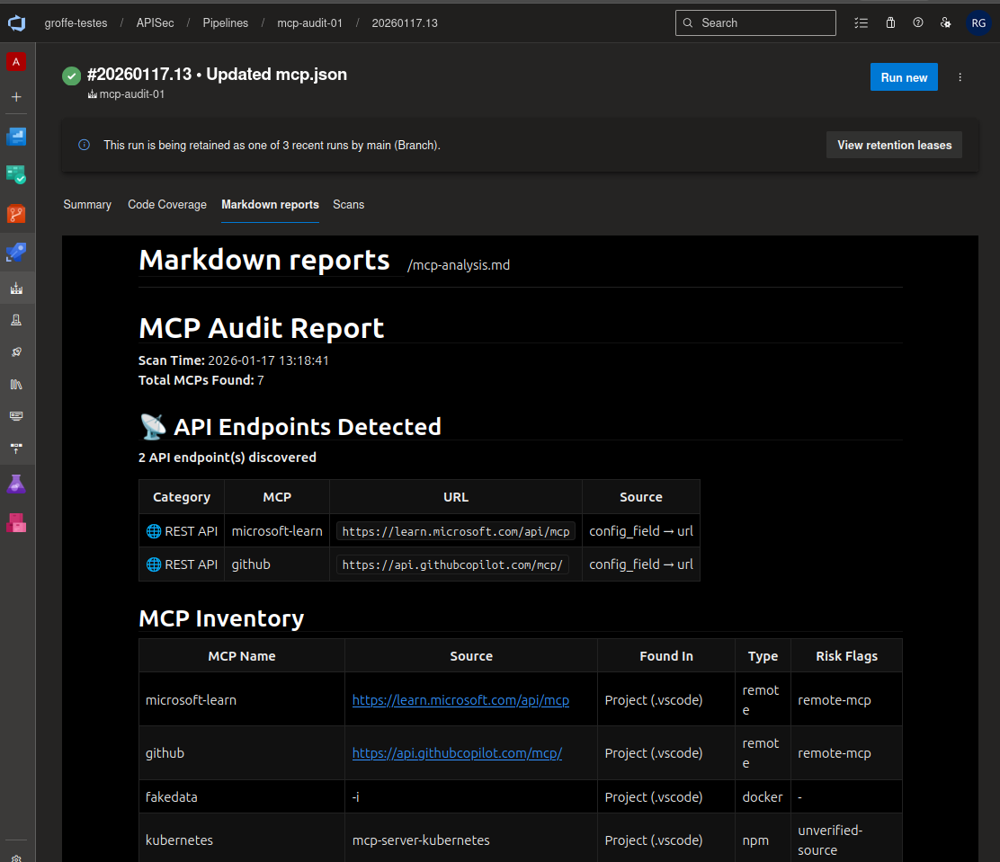

# azdevops-apisec-mcp-audit_v1.0.0
Exemplo de uso da ferramenta MCP Audit (APIsec University) em um pipeline do Azure DevOps. Testes realizados com vários tipos de MCP Servers (Microsoft Learn, GitHub, Kubernetes - package npm, gerador de dados fake - imagem Docker).

*Example of using the MCP Audit tool (APIsec University) in an Azure DevOps pipeline. Tests performed with various types of MCP Servers (Microsoft Learn, GitHub, Kubernetes - npm package, fake data generator - Docker image).*

MCP Audit - GitHub: https://github.com/apisec-inc/mcp-audit

---

## Results -- Resultados

Execução do pipeline:

*Pipeline execution:*

Relatório Markdown:

*Markdown report:*

